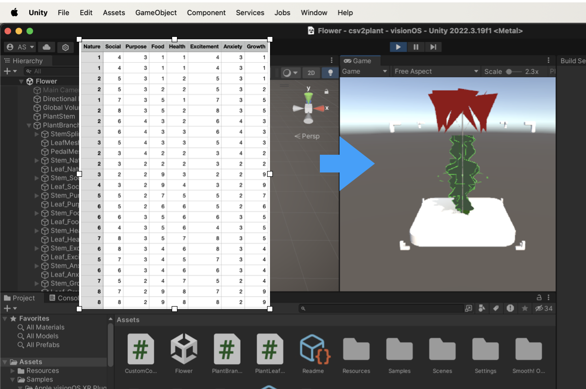

# csv2plant
Creating plant-like 3D models based on CSV datasets

### Basic Workflow
1. Update the [Survey CSV](./Assets/StreamingAssets/Survey01.csv) file with relevant survey results
2. [Branch Stem](./Assets/PlantBranchSpline.cs) and [Branch Leaf](./Assets/PlantLeafMesh.cs) files parse this survey file, and generate plant stem components accordingly
